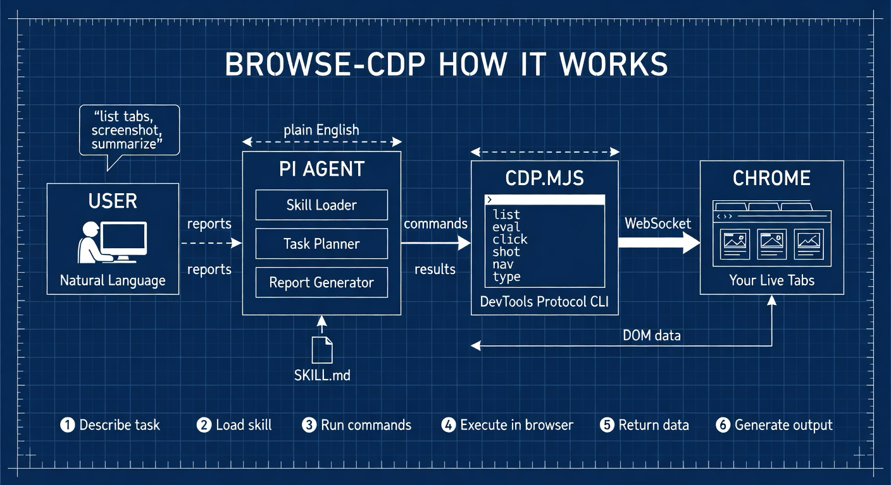

# browse-cdp

Automate your browser with [pi](https://pi.dev) and the [chrome-cdp](https://github.com/pasky/chrome-cdp-skill) skill. No Puppeteer, no Playwright, no headless browsers — just your real Chrome session, controlled by an AI agent over the DevTools Protocol.

## Why

You already have tabs open. You're already logged in. Your cookies, sessions, and extensions are all there. Instead of scripting a throwaway headless browser, `browse-cdp` lets pi operate directly on your live Chrome — reading pages, clicking buttons, filling forms, extracting data, and taking screenshots across all your open tabs.

This project provides a workspace and growing collection of pi skills for common browser automation tasks, starting with YouTube transcript extraction and report generation.

## Prerequisites

| Requirement | Why |
|---|---|
| **[pi](https://pi.dev)** | AI coding agent that orchestrates everything |
| **Node.js 22+** | chrome-cdp uses built-in WebSocket (no dependencies) |
| **Chrome** | Your regular browser — not headless, not Chromium |
| **Chrome remote debugging** | The bridge between pi and your tabs |

### Enable Chrome Remote Debugging

1. Open Chrome
2. Navigate to `chrome://inspect/#remote-debugging`
3. Toggle the switch **on**

That's it. No launch flags, no restart required.

## Quick Start

```bash
# Clone the repo
git clone https://github.com/yourusername/browse-cdp.git
cd browse-cdp

# Install the chrome-cdp skill (if not already installed)
pi install git:github.com/pasky/chrome-cdp-skill

# Start pi and ask it to do things in your browser
pi
```

Then just talk to pi:

```
> List my open Chrome tabs
> Take a screenshot of the TradingView tab
> Go to https://example.com and extract all the headings
> Summarize this YouTube video: https://www.youtube.com/watch?v=...
```

## What You Can Do

### Browse & Interact

pi can see and control any tab you have open:

- **List tabs** — see every open page with its target ID
- **Screenshot** — capture the viewport of any tab
- **Navigate** — send a tab to a new URL
- **Click** — by CSS selector or exact coordinates
- **Type** — insert text into focused inputs, even cross-origin iframes
- **Evaluate JS** — run arbitrary JavaScript in any tab's context
- **Read HTML** — extract the full DOM or a specific element
- **Accessibility tree** — get a structured snapshot of page content

### Extract & Analyze

Use pi to pull structured data out of pages:

- Scrape tables, lists, or article text from any open page
- Extract and compare product prices across tabs
- Pull form data, monitoring dashboards, or analytics
- Read emails, notifications, or feed content

### YouTube Transcripts & Reports

The bundled `youtube-transcript` skill automates the full pipeline:

1. Open a YouTube video in Chrome
2. Ask pi to summarize it
3. Get a polished Markdown report with an executive summary and top 25 takeaways

```
> Summarize this YouTube video: https://www.youtube.com/watch?v=n4E4xNYCkYM
```

See [`skills/youtube-transcript/`](skills/youtube-transcript/SKILL.md) for details.

## Project Structure

```
browse-cdp/
├── README.md
├── skills/
│   └── youtube-transcript/        # Pi skill: YouTube → transcript → report
│       ├── SKILL.md               # Skill manifest and workflow instructions
│       └── scripts/
│           ├── setup.sh           # Dependency checker / chrome-cdp installer
│           └── extract-transcript.mjs  # Transcript extraction via CDP
└── artifacts/                     # Generated reports and outputs
```

## Skills

Skills are self-contained capability packages that pi loads on-demand. Place them in `skills/` and pi discovers them automatically when you run it from this directory.

| Skill | Description |
|---|---|
| [`youtube-transcript`](skills/youtube-transcript/SKILL.md) | Extract YouTube transcripts and generate summary reports with executive summary and top 25 takeaways |

### Using the Skills

Pi picks up skills automatically from the `skills/` directory. You can also invoke them explicitly:

```
/skill:youtube-transcript https://www.youtube.com/watch?v=VIDEO_ID
```

Or just describe what you want — pi matches your request to the right skill based on its description.

### Creating New Skills

Add a new directory under `skills/` with a `SKILL.md` file:

```
skills/
└── my-new-skill/
    ├── SKILL.md          # Required: frontmatter + instructions
    └── scripts/          # Helper scripts
```

The `SKILL.md` needs a `name` and `description` in its frontmatter. See the [pi skills documentation](https://pi.dev) and the `youtube-transcript` skill as a reference.

Ideas for new skills:
- **page-to-pdf** — screenshot and convert any page to a multi-page PDF
- **form-filler** — auto-fill web forms from structured data
- **price-tracker** — monitor product prices across e-commerce tabs
- **site-auditor** — crawl and audit a site for SEO, accessibility, or performance
- **tab-archiver** — snapshot all open tabs to Markdown for later reference
- **email-digest** — extract and summarize unread emails from Gmail

## How It Works



1. **Describe task** — You tell pi what you want in plain English
2. **Load skill** — pi reads the relevant skill (e.g. `youtube-transcript`) and plans the approach
3. **Run commands** — pi calls `cdp.mjs` with commands like `list`, `eval`, `click`, `shot`, `nav`, `type`
4. **Execute in browser** — `cdp.mjs` connects to Chrome over a WebSocket using the DevTools Protocol
5. **Return data** — Chrome sends back DOM content, screenshots, evaluation results
6. **Generate output** — pi synthesizes the data into reports, summaries, or takes the next action

There's no browser to spin up, no login flows to replay, no cookies to manage. It's just your browser.

## Tips

- **Keep Chrome remote debugging on** — it doesn't affect normal browsing
- **One tab, one task** — if you need pi to work with a specific page, have it open before you ask
- **Screenshots for visual context** — pi can take and analyze screenshots to understand page layouts
- **Stable selectors** — when writing custom automations, prefer IDs and data attributes over positional selectors that break when the DOM changes
- **Long-running tabs** — Chrome shows an "Allow debugging" modal on first access per tab; a background daemon keeps the session alive after that

## License

MIT
